## Erwerbung - Bestellungen 
### Bestellungen suchen
Im Erwerbungsmodul kann nach einzelnen Bestellungen gesucht werden. Hierfür muss der Reiter „Bestellungen durchsuchen“ ausgewählt werden.

 
Angezeigt werden die Felder „Titel“ und „Lieferant“. Durch einen Klick auf das „[+]“ Symbol werden zusätzlich Suchfelder für „Bestellung“ und „Rechnungsnr.“ eingeblendet. Sind weitere Suchfelder notwendig, kann mit „Erweiterte Suche“ ein ausführlicheres Formular aufgerufen werden.

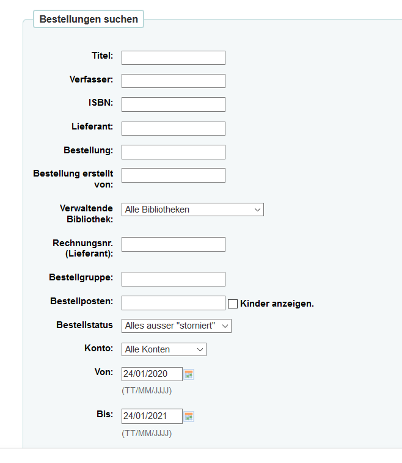

 

### Neue Bestellung anlegen
Um eine neue Bestellung anlegen zu können, muss im ersten Schritt nach dem Lieferanten gesucht werden, bei dem die Medien bestellt werden sollen (s. auch Lieferanten suchen).
Hier findet sich anschließend die Schaltfläche *„neue Bestellung“*.
 

 
Es öffnet sich eine Maske, mit der eine neue Bestellung angelegt werden kann. Dieser Bestellung können im nächsten Schritt die einzelnen zu bestellenden Medien zugeordnet werden.
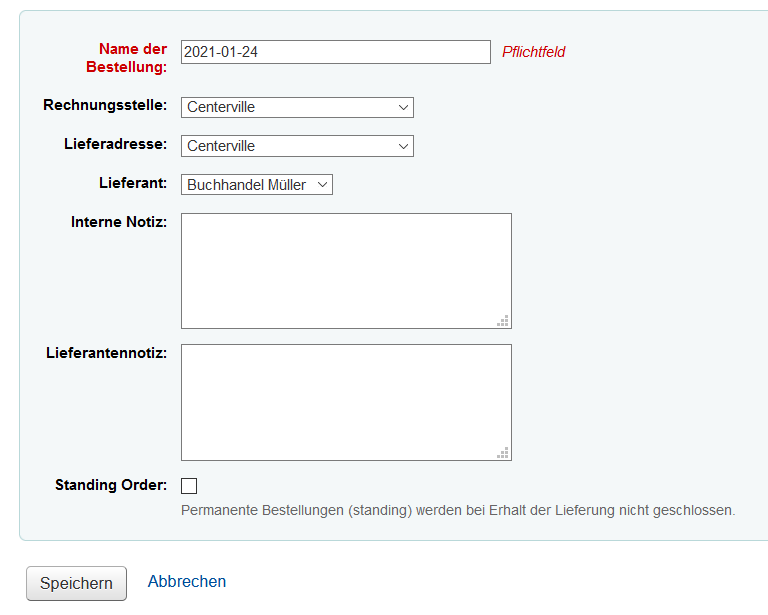

 
Verpflichtend ist beim Anlegen der Bestellung ein eindeutiger **Name** für die Bestellung. Möglich wäre hierfür beispielsweise das Tagesdatum, aber auch interne Bestellnummern oder beschreibende Begriffe sind denkbar.
**Rechnungsstelle und Lieferadresse**: Angegeben wird hier die Bibliothek. 
**Lieferant**: Dieser kann in dieser Maske bei Bedarf noch einmal angepasst werden.
**Interne Notiz/Lieferantennotiz**: wird in allen Schritten der Erwerbungsbearbeitung angezeigt, nur die Lieferantennotiz wird auf den PDF-Bestellscheinen mit ausgegeben.
**Standing Order**: Wird eine Bestellung als Standing Order markiert, wird diese bei Erhalt der Lieferung *nicht* geschlossen, es können somit jederzeit weitere Rechnungen zur Bestellung hinzugefügt werden.
*„Exemplare erzeugen bei“* legt fest, ob im Erwerbungsprozess bei Bestellung oder bei Zugang Exemplare angelegt werden sollen. Alternativ kann man auch ganz auf die Erzeugung von Exemplaren verzichten (z.B. bei elektronischen Ressourcen), in dem man „bei Katalogisierung“ wählt. Die Voreinstellung für diesen Wert wird aus den Systemparametern gezogen.
Mit „Speichern“ wird die Bestellung gespeichert und die folgende Übersicht angezeigt:

 
Der Korb kann mit *„Korb bearbeiten“* bei Bedarf noch einmal angepasst werden. Mit *„diese Bestellung löschen“* kann der angelegte Bestellkorb gelöscht werden.

### Bestellposten anlegen

Mit *„Neuer Bestellposten“* können nun Medien zur Bestellung hinzugefügt werden. 

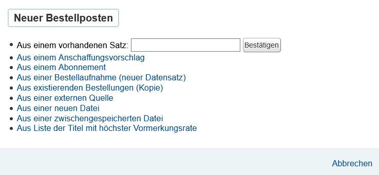

 

### Bestellung über Z39.50
Ist die Z39.50-Schnittstelle konfiguriert, können hierüber relativ unkompliziert Medien und die dazugehörigen Titeldaten recherchiert und für die Bestellung übernommen werden. Hierfür muss die Option „Aus einer externen Quelle“ ausgewählt werden.

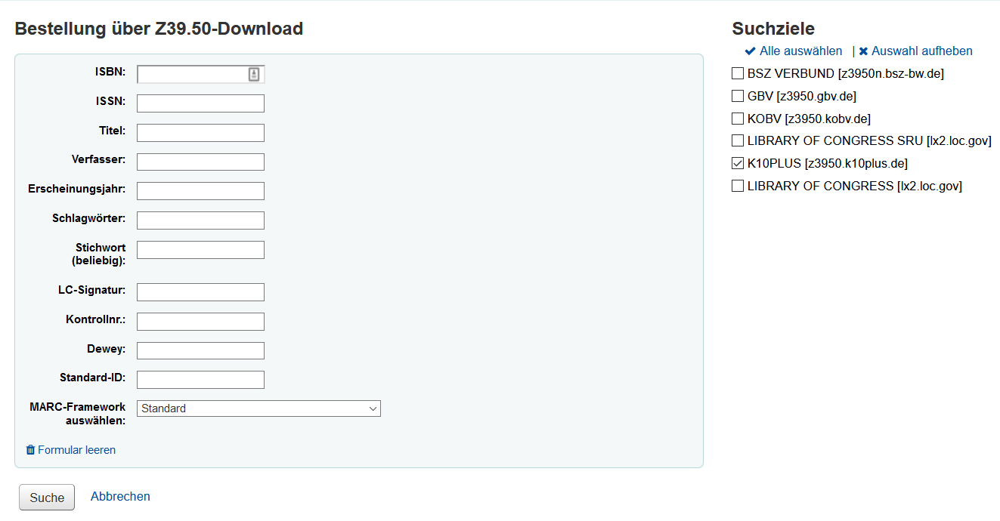

 
Rechts unter „Suchziele“ können nun gegebenenfalls mehrere externe Kataloge ausgewählt werden, in denen nach den zu bestellenden Medien gesucht werden soll. Im Formular können die zum Titel bekannten Informationen eingegeben werden.
Es bietet sich an, vor der Bestellung nach möglichst vielen eindeutigen Informationen zum Titel zu suchen. Bei Büchern ist die eindeutigste Identifikation meist die ISBN. Hiermit vermeidet man das versehentliche Bestellen von älteren Auflagen oder auch anderen Medienformen (beispielsweise der elektronischen Ausgabe anstatt der Printausgabe). 

 

Werden Treffer in den angegebenen Suchzielen gefunden, werden diese in eine Liste angezeigt. Hier kann es vorkommen, dass einige Treffer dem Titel nach identisch zu sein scheinen. Mit der Schaltfläche „Vorschau“ kann man sich weitere Informationen zu den Treffern anzeigen lassen.

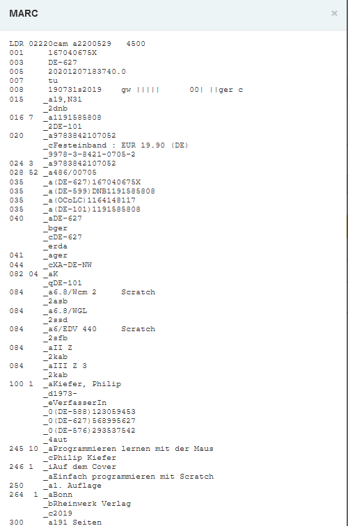

 
*MARC-Ansicht*

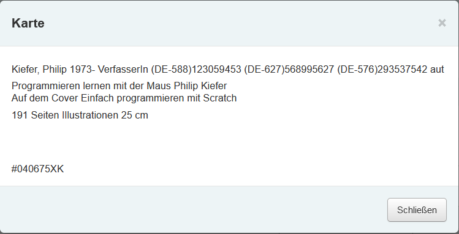

 
*Karten-Ansicht*
Hier sollte man darauf achten, ob es sich bei dem vorliegenden Medium um E-Book handelt. Dies ist beispielsweise in der Karten-Ansicht durch den Hinweis *„online resource“* ersichtlich. 

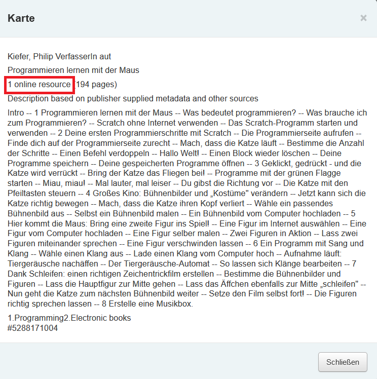

 
*Karten-Ansicht einer elektronischen Ressource*
Ist der gewünschte Titel in der korrekten Form gefunden, können die Informationen mit „bestellen“ übernommen werden.
Das sich nun öffnende Bestellformular ist in 4 Teile unterteilt: Der Bestellkopf, die Angaben aus dem Katalog, die Angaben für das Exemplar (wenn in der Konfiguration, bzw. im Bestellkorb, eingestellt ist, dass Exemplare bereits bei der Bestellung angelegt werden) und die Buchungsdetails.
Am Ende des Abschnitts „Exemplar“ kann mit *„Exemplar hinzufügen“* ein neues Exemplar generiert werden. Sollen mehrere Exemplare erworben werden, kann dies über den Button „mehrere Exemplare hinzufügen“ erfolgen.

 
Im Abschnitt *„Buchungsdetails“* wird dadurch automatisch das Pflichtfeld „Anzahl“ aktualisiert.

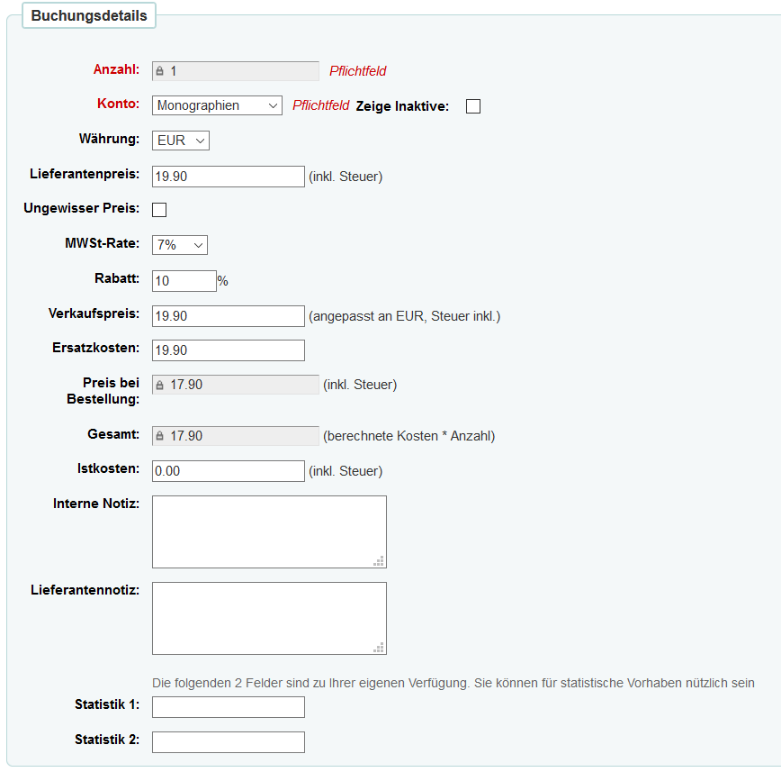
  
Im Feld Konto wird das zu belastende Konto ausgewählt. In den Buchungsdetails wird der Preis eingetragen (Feld *Lieferantenpreis*). Dieser muss ggfs. extern noch einmal recherchiert werden. MWSt-Rate und Rabatt werden aus dem Lieferantendatensatz gezogen und können an dieser Stelle geändert werden. Der Gesamtpreis aller Exemplare mit Rabatten wird automatisch berechnet und eingetragen.
Nach Abspeichern der Bestellung können auf diesen Bestellkopf weitere Bestellposten (Bestelltitel) angelegt werden.
In der nachfolgend angezeigten Übersicht kann die angelegte Bestellung geändert und auch storniert werden. Mit „Bestellung stornieren“ werden der Bestellposten und das Exemplar storniert, mit „Bestellung stornieren und Titelsatz löschen“ wird zusätzlich der Titel aus dem System entfernt.

 

### Bestellungen abschließen und verschicken

Wurden alle gewünschten Bestellposten angelegt, kann der Korb im Bestellkopf geschlossen werden:

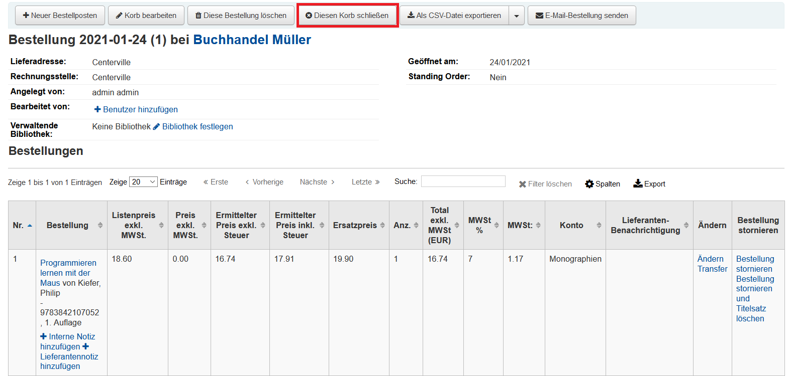

 
Für den PDF-Druck muss die Bestellung einer Bestellgruppe zugeordnet werden.
Ist der Korb geschlossen, wird zum Lieferanten gewechselt.
Hier besteht die Möglichkeit, die Bestellung einer Bestellgruppe zuzuordnen, wenn dies nicht schon erfolgt ist. Dazu wird auf der linken Seite die Bestellgruppe ausgewählt.

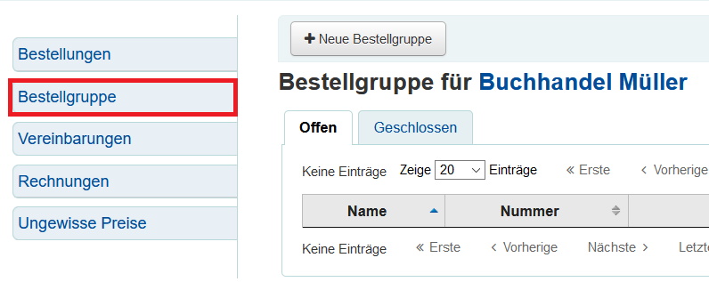

 
Über den Button *“Neue Bestellgruppe“* kann eine neue Bestellgruppe angelegt werden. Alle Bestellungen, die in dem geschlossenen Korb liegen, werden hier angezeigt.

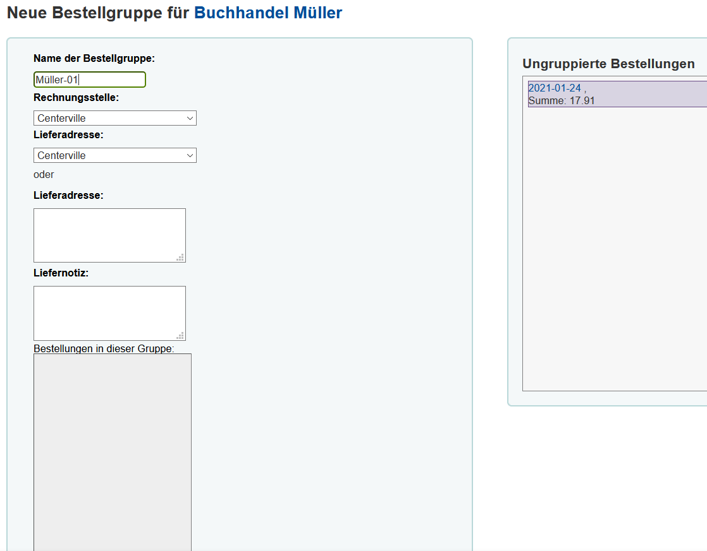
 
Die Bestellungen im Feld *„Ungruppierte Bestellungen“* müssen mit der Maus per Drag-and-Drop in das Feld Bestellungen in dieser Gruppe gezogen werden. Nach dem Abspeichern können die Bestellungen als PDF exportiert und ggf. gedruckt werden. 

 
 Werden diese Funktionen nicht genutzt, ist die Verwendung von Bestellgruppen nicht erforderlich und rein optional.

### Lieferung und Rechnungsbearbeitung
Ist die Lieferung eingetroffen, muss zunächst der betreffende Lieferant gesucht werden (s. hierfür *Lieferant suchen*).

 
Hier kann nun mit der Schaltfläche „Lieferung erhalten“ eine neue Lieferung angelegt werden.

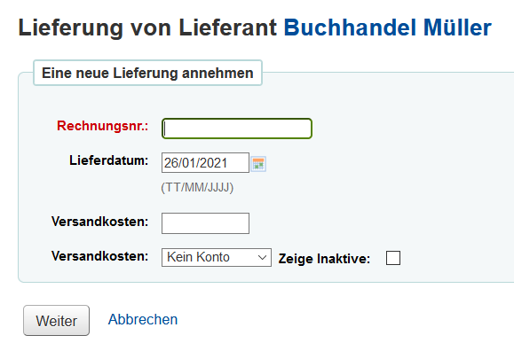

 
Für die Lieferung kann nun die Rechnungsnummer angegeben werden, die im Normalfall auf der mitgelieferten Rechnung angegeben ist. Das Lieferdatum wird automatisch befüllt, kann aber auch manuell angepasst werden. Außerdem können die entstandenen Versandkosten, sowie ein dazugehöriges Konto angegeben werden, das hierfür belastet werden soll.

 
Mit „Zugang“ kann das Eintreffen einer Bestellung bestätigt werden.

 
Es öffnet sich die Maske *„Exemplarzugang“*. Hier muss im Feld „Gelieferte Anzahl“ die gelieferte Menge angegeben werden. Links im Bereich „Exemplare“ finden sich die ggfs. bei der Bestellung angelegten Exemplare, die mit „Bearbeiten“ noch einmal überarbeitet werden können.
In dieser Übersicht ist es möglich, das zu belastende Konto sowie MWSt.-Rate oder Kosten zu ändern. 
Nach dem Speichern werden die gelieferten Medien unter *„Bereits zugegangen“* angezeigt.
Über den Button *“Lieferung abschließen“* werden alle Informationen zur Rechnung aufgelistet. Die Rechnungsdetails können hier erneut bearbeitet werden.
